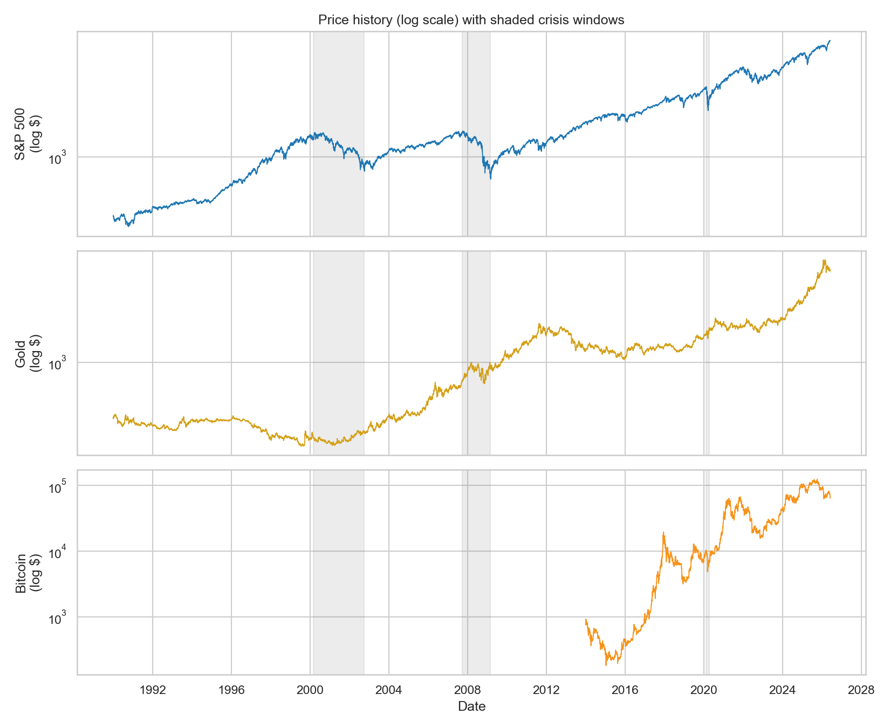
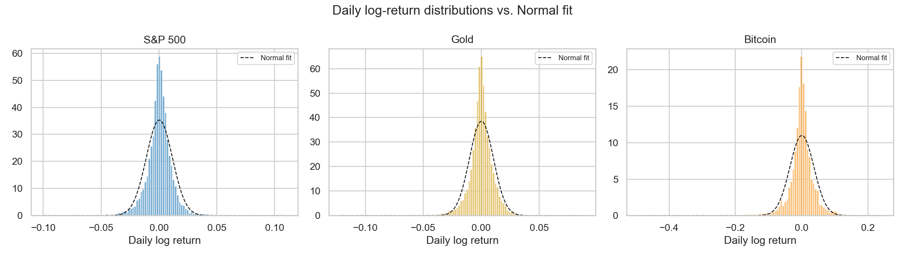
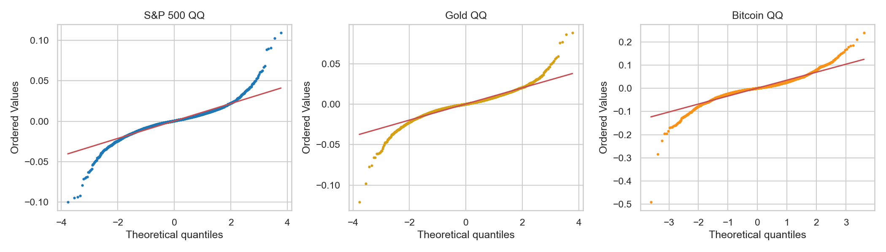
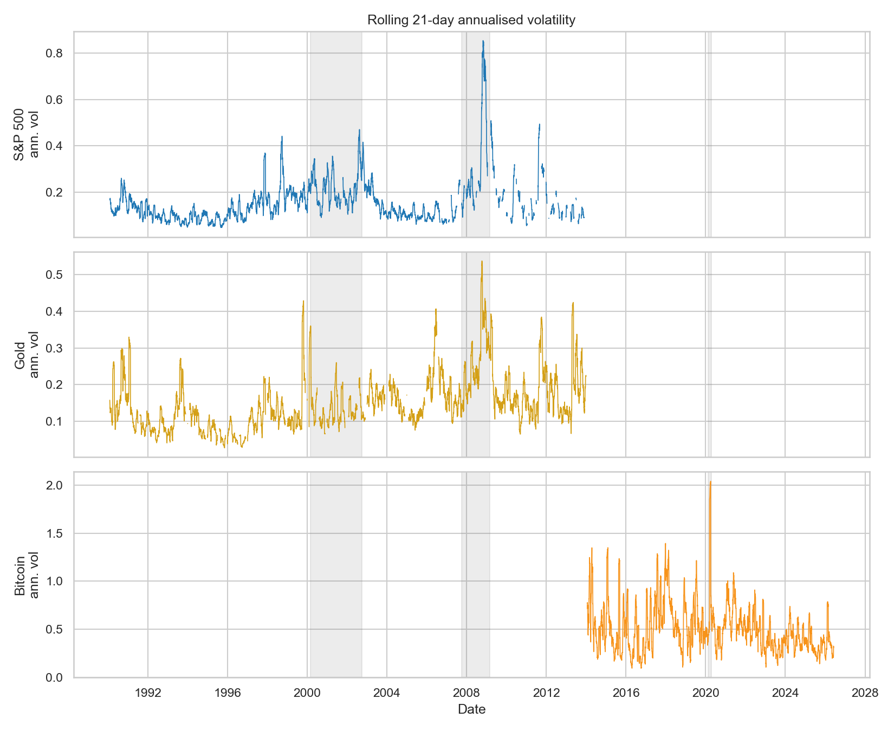
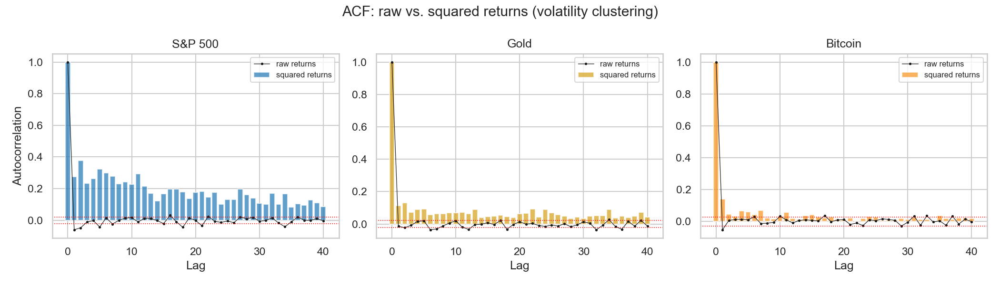
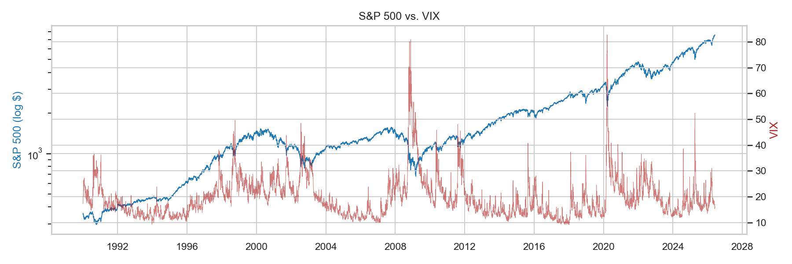
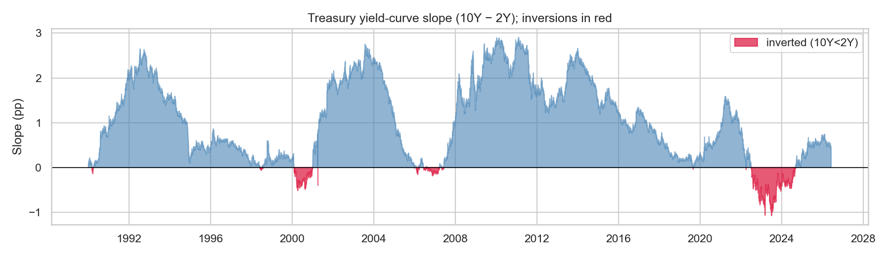
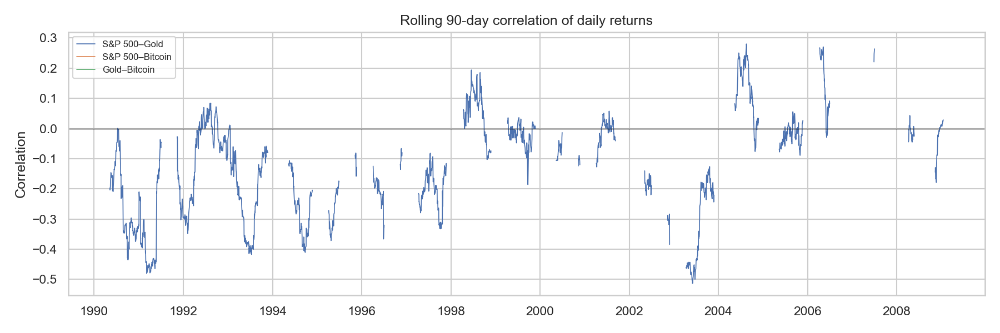
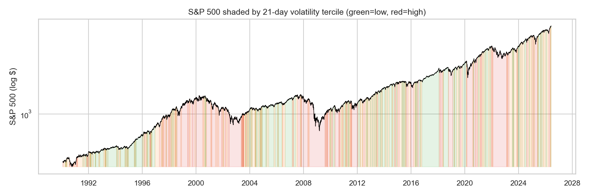
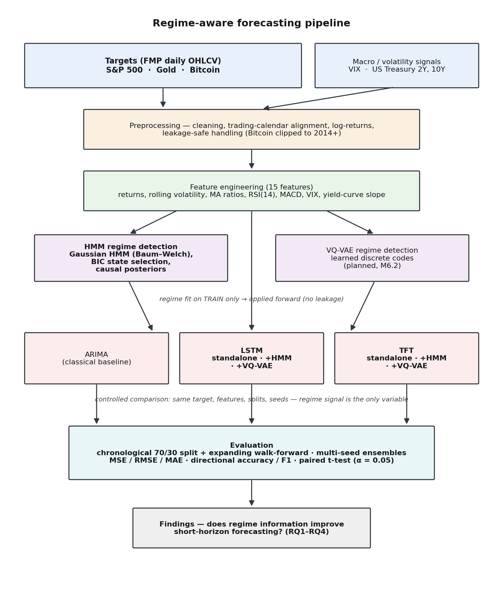

# Abstract

Financial markets alternate between persistent behavioural states — calm uptrends, turbulent selloffs, and range-bound consolidations — that are never directly labelled in price data. This project investigates whether explicitly recovering these latent *regimes* improves short-horizon forecasting. A Gaussian Hidden Markov Model (HMM) is used to infer hidden market states from daily returns and volatility, and the inferred regime is supplied to sequence-learning forecasters to test whether that contextual information measurably improves next-day prediction of returns and direction. The study spans three structurally distinct markets — the S&P 500 equity index, gold, and Bitcoin — so that conclusions are not specific to a single asset class, and it uses the VIX and U.S. Treasury yields as macro-volatility inputs. The central question is evaluated as a controlled experiment in which a regime-aware model and an otherwise identical regime-blind baseline differ only in the presence of the regime signal, with statistical significance assessed by a paired test across walk-forward folds. This submission reports two completed milestones. First, a comprehensive literature review situates the work within the regime-switching, deep-learning-forecasting, and hybrid HMM–neural-network literatures, and identifies gaps that motivate the chosen design: limited cross-asset generalisation, a tendency to forecast non-stationary price levels rather than returns, weak significance testing, and an absence of comparison against modern attention-based backbones. Second, an exploratory data analysis of more than three decades of daily data confirms the empirical properties that justify a regime-switching approach: pronounced heavy tails (excess kurtosis of 9.5, 9.0, and 12.4 for the S&P 500, gold, and Bitcoin), strong volatility clustering, and statistically decisive departures from normality. The methodology and planned experimental protocol are described, and the project repository is provided for reproducibility.

**Keywords:** market regime detection; hidden Markov model; LSTM; financial time-series forecasting; volatility clustering; exploratory data analysis.

# 1. Introduction

The prediction of financial asset movements is among the most studied and most difficult problems in quantitative finance, because price series are noisy, non-stationary, and only weakly autocorrelated at the daily horizon. A recurring observation in the empirical literature is that markets do not behave homogeneously over time: the statistical properties of returns — their mean, variance, and correlation structure — shift across distinct and persistent *regimes* [1]. A forecasting model fitted on aggregate history implicitly averages over these regimes and can therefore perform poorly precisely when conditions change, such as during a transition into a high-volatility crisis state.

This project examines a direct response to that problem: estimate the prevailing market regime explicitly and provide it to a forecasting model as additional context. Regimes are treated as latent (unobserved) states and recovered with a Hidden Markov Model, a probabilistic sequence model well suited to inferring hidden generative states from noisy observations [2]. The recovered regime is then supplied to a Long Short-Term Memory (LSTM) network — and, in an extension, to a Temporal Fusion Transformer (TFT) — to test whether regime information yields a measurable forecasting improvement over an identical model that does not receive it.

The work is guided by four research questions:

1. **RQ1** — Can an HMM reliably identify distinct, interpretable market regimes from financial time series?
2. **RQ2** — Does incorporating regime information improve forecasting accuracy?
3. **RQ3** — How does the proposed hybrid model compare against standard baselines (ARIMA and a standalone LSTM)?
4. **RQ4** — Does a *learned* discrete regime representation capture market states more usefully than a Gaussian HMM?

These questions are framed as a formal hypothesis test. The null hypothesis is that regime information does not improve performance; the alternative is that it does. The hypothesis is evaluated with a paired statistical test (α = 0.05) on per-fold performance differences, so that any reported improvement is supported by evidence rather than a single favourable run.

This document covers two completed components of the project. Section 2 presents the literature review and the critical analysis from which the research gap and design choices are derived. Section 3 describes the dataset, its constraints, the preprocessing pipeline, and the exploratory data analysis. Section 4 sets out the project methodology and the planned experimental protocol, including a process diagram. Section 5 provides the repository link, and Section 6 lists the references.

# 2. Literature Review

The project draws on three research streams that have historically developed in parallel: (i) regime-switching models in financial econometrics, (ii) deep learning for financial forecasting, and (iii) hybrid models that combine the two. A fourth, emerging stream concerns modern attention-based architectures and learned latent representations, which motivate the project's planned extensions. This section reviews each in turn and concludes with a critical analysis that identifies the gaps the project addresses.

## 2.1 Regime-switching models and latent market states

The formal study of regime changes in economic time series is usually traced to Hamilton's Markov-switching model, which treats the parameters of an autoregression as the outcome of a discrete, unobserved Markov process and provides a tractable framework for inferring when an economy transitions between states such as expansion and recession [3]. The model has become a predominant approach in business-cycle dating and has been applied widely across macroeconomics and finance.

In the financial setting, the Hidden Markov Model provides the same latent-state machinery in a form geared toward inference from noisy observations. Rabiner's tutorial established the canonical algorithms — the forward–backward procedure, the Viterbi decoding of the most likely state path, and Baum–Welch parameter estimation — that remain the standard toolkit [2]. Applied to returns and volatility, an HMM recovers states that correspond to recognisable market conditions, for example low-volatility bull phases and high-volatility bear phases, and yields both a decoded regime label and the posterior probability of each state at every point in time.

The motivation for a regime-switching view is grounded in the empirical properties of returns. Cont's widely cited synthesis of *stylized facts* documents that asset returns exhibit heavy tails and positive excess kurtosis, negligible linear autocorrelation, and pronounced *volatility clustering* — large changes tend to be followed by large changes, producing slowly decaying autocorrelation in squared returns [1]. A single-distribution model cannot simultaneously reproduce these features, whereas a mixture of regime-conditional distributions can, which provides a principled statistical reason to model returns as regime-dependent.

## 2.2 Deep learning for financial forecasting

The Long Short-Term Memory network introduced by Hochreiter and Schmidhuber addressed the vanishing-gradient limitation of earlier recurrent networks through a gated memory cell, enabling the learning of long-range temporal dependencies [4]. This capability is directly relevant to financial sequences, where informative structure may span weeks or months.

The most influential large-scale demonstration in finance is the study by Fischer and Krauss, who applied LSTM networks to next-day directional prediction of all S&P 500 constituent stocks over 1992–2015 [5]. They reported that LSTMs outperformed memory-free benchmarks such as random forests and standard feed-forward networks, achieving daily directional accuracy near 56% and positive risk-adjusted returns net of transaction costs. The result established LSTMs as a strong and reproducible baseline for daily financial forecasting and is a primary reference point for the standalone-LSTM baseline used in this project.

## 2.3 Hybrid regime-aware deep learning

A growing body of work combines regime detection with sequence learning, which is the design space this project occupies. Hu studied a combined HMM–LSTM approach on the S&P 500 index, using the HMM to characterise market states and the LSTM to forecast, and reported improved forecasting from the integration [6]. Liu et al. analysed market trends with a comparable HMM–LSTM pipeline, using the HMM to segment the series into states that condition subsequent learning [7]. Li et al. proposed a modified LSTM (Mid-LSTM) oriented toward anomaly-aware risk management, illustrating how latent-state information can be incorporated to improve robustness in turbulent periods [8]. Most directly related to the present work, Jiang et al. introduced a hidden-state-guided deep learning model (HMM-ALSTM) in which an HMM provides state information that guides an attention-augmented LSTM, reporting gains on stock-movement forecasting over regime-blind counterparts [9]. Collectively, these studies provide encouraging evidence that regime information *can* help, and they inform two concrete design choices adopted here: a sixty-day input window, consistent with the conventions used in this literature, and the integration of regime information by concatenating the HMM posterior probabilities with the model's input features.

## 2.4 Attention-based architectures and learned representations

Two further developments motivate the project's planned extensions. The Transformer architecture of Vaswani et al. replaced recurrence with self-attention, allowing models to relate distant positions in a sequence directly and to expose attention weights as a form of interpretability [10]. Building on this, Lim et al. proposed the Temporal Fusion Transformer (TFT), an attention-based architecture for multi-horizon forecasting that combines recurrent local processing with interpretable self-attention, incorporates variable-selection gating, and natively distinguishes static covariates, known-future inputs, and past-observed inputs [11]. The TFT's built-in variable-importance and temporal-attention outputs make it an attractive modern backbone for an interpretability-conscious study, and it serves as the project's second forecasting backbone.

On the representation side, van den Oord et al. introduced the Vector-Quantised Variational Autoencoder (VQ-VAE), which learns a discrete codebook of latent states through vector quantisation [12]. A VQ-VAE can therefore learn data-driven, non-Gaussian regime codes, in contrast to the parametric Gaussian states of a classical HMM. This motivates the project's fourth research question, which compares an HMM regime representation against a learned discrete representation.

## 2.5 Critical analysis and research gap

While the hybrid HMM–neural-network literature is encouraging, a critical reading reveals several recurring limitations that this project is designed to address.

*Limited cross-asset generalisation.* Much of the hybrid work is demonstrated on a single market, predominantly a major equity index such as the S&P 500 [6], [7]. Whether the benefit of regime information generalises across asset classes with very different dynamics — a low-volatility equity index, a safe-haven commodity, and a high-volatility cryptocurrency — is rarely tested. This project evaluates all three.

*Forecasting price levels rather than returns.* A number of studies target price levels, on which a naive predictor that simply repeats the previous price can appear highly accurate because prices are strongly autocorrelated and non-stationary. This inflates reported performance and obscures genuine predictive skill. Consistent with the stylized-facts literature [1], this project forecasts next-day log-returns and direction, which are the appropriate stationary targets for measuring forecasting ability.

*Weak statistical significance testing.* Improvements attributed to regime information are frequently reported as point differences in accuracy without a significance test, leaving open whether the gain exceeds run-to-run variation. This project evaluates the regime contribution with a paired test across walk-forward folds and multi-seed ensembles.

*Leakage risk in regime integration.* When regime states are estimated on the full sample and then used as model inputs, future information can leak into the training set. This project fits the regime model on the training partition only and uses causal, forward-filtered posteriors, so that every regime input respects the arrow of time.

*Absence of modern backbones and learned regimes.* The hybrid literature is built almost entirely on recurrent backbones and Gaussian HMM states. It is largely unknown whether the value of regime information persists when the forecaster is a modern attention-based model [11], or whether a learned discrete regime representation [12] is more informative than a Gaussian HMM. This project addresses both questions by adding TFT-based arms and a planned VQ-VAE regime detector.

Taken together, these gaps justify the project's design: a controlled, leakage-safe, multi-asset comparison that isolates the value of regime information, evaluates it with proper significance testing on stationary targets, and benchmarks it across both recurrent and attention-based backbones with classical and learned regime representations.

# 3. Data Description and Exploratory Data Analysis

## 3.1 Dataset summary

The study uses daily data obtained from Financial Modeling Prep (FMP) under a paid subscription. Three assets are treated as forecasting *targets*, chosen to span distinct asset classes and risk profiles: the **S&P 500** equity index, **gold** (spot, USD), and **Bitcoin** (USD). Two further series are used as *signals* — model inputs rather than forecasting targets — because they are established indicators of market stress: the **CBOE Volatility Index (VIX)** and **U.S. Treasury yields** at the 2-year and 10-year tenors, from which the 10Y–2Y yield-curve slope is derived. Table 1 summarises the coverage of each target series.

Table 1. Data coverage by target asset.

| Asset | First | Last | Observations |
|-------|-------|------|-------------:|
| S&P 500 | 1990-01-02 | 2026-06-03 | 9,172 |
| Gold | 1990-01-02 | 2026-06-04 | 9,304 |
| Bitcoin | 2014-01-01 | 2026-06-04 | 4,538 |

## 3.2 Constraints and preprocessing

Several data constraints shaped the preprocessing pipeline, which was implemented to be fully reproducible and leakage-safe.

- **Bitcoin start date.** Bitcoin's pre-2014 FMP history is sparse and illiquid, with near-zero and unreliable pricing. The series is therefore clipped to begin on 1 January 2014, so that the analysis uses only the period of genuine, liquid trading. This is documented in the project methodology.
- **Calendar alignment.** The target and signal series follow different trading calendars (equities and Treasuries observe market holidays; Bitcoin trades continuously). All series are aligned to a common index, and the macro signals are forward-filled onto the target calendar so that, for example, a weekend cryptocurrency observation inherits the most recently *known* macro state. Forward-filling uses only past information and therefore introduces no look-ahead.
- **Return transformation.** Prices are converted to daily log-returns. The forecasting target is the *next-day* log-return (a shift of one trading day), and direction is its sign, which keeps the prediction target stationary and prevents the inflated accuracy associated with predicting price levels.
- **Missing values and warm-up.** Rows containing missing values from rolling-window warm-up periods are removed, and the final row of each series, which has no next-day target, is dropped. This accounts for the difference between the raw observation counts in Table 1 and the smaller number of usable return observations in Table 2.
- **Volume excluded.** FMP volume coverage is inconsistent across the target series and absent for multi-year spans of the gold and Bitcoin histories. Volume features are excluded by default to preserve a uniform feature set and maximise the usable sample.
- **Security.** The FMP API key is kept out of source control via an environment file, supporting safe public release of the code.

## 3.3 Descriptive statistics

Table 2 reports descriptive statistics for the daily log-returns of each target asset. The statistics quantify the stylized facts that motivate a regime-switching approach.

Table 2. Descriptive statistics of daily log-returns. Annualised volatility uses a 252-day convention; excess kurtosis is reported relative to the normal value of 0; *JB p* is the Jarque–Bera test p-value for normality.

| Asset | n | Mean | Std. | Ann. vol. | Skew | Excess kurt. | Min | Max | JB *p* |
|-------|----:|-----:|-----:|---------:|-----:|------------:|-----:|----:|-----:|
| S&P 500 | 8,451 | 0.0003 | 0.0113 | 0.180 | −0.17 | 9.49 | −0.100 | 0.110 | 0.000 |
| Gold | 8,623 | 0.0002 | 0.0104 | 0.165 | −0.45 | 8.97 | −0.121 | 0.088 | 0.000 |
| Bitcoin | 4,537 | 0.0010 | 0.0363 | 0.576 | −0.74 | 12.44 | −0.491 | 0.241 | 0.000 |

Three observations stand out. First, the three assets occupy very different volatility regimes: annualised volatility rises from roughly 18% for the S&P 500 and 16% for gold to 58% for Bitcoin, confirming the intended spread of risk profiles. Second, all three series exhibit large positive excess kurtosis (9.5, 9.0, and 12.4), indicating heavy tails far removed from a normal distribution, together with negative skewness that is most pronounced for Bitcoin. Third, the Jarque–Bera test rejects normality decisively for every asset (p ≈ 0).

## 3.4 Exploratory analysis and visualisation

The exploratory analysis examines the price histories, the return distributions, the dependence structure of volatility, and the macro context. Figures 1–9 present the visual evidence.

{width=95%}

{width=95%}

{width=95%}

{width=95%}

{width=85%}

{width=95%}

{width=95%}

{width=95%}

{width=95%}

## 3.5 Implications for modelling

The exploratory analysis yields three conclusions that directly shape the modelling approach. First, the heavy tails and decisive non-normality imply that a single Gaussian model is misspecified, whereas a mixture of regime-conditional distributions — as recovered by an HMM — can better represent the conditional return distribution. Second, the strong and persistent volatility clustering indicates that latent, persistent states exist for a regime model to recover, satisfying a precondition for the HMM to be useful. Third, the time-varying cross-asset correlations suggest that the appropriate forecasting context changes over time, which is precisely the information a regime signal is intended to supply. These findings collectively support the central hypothesis that regime context can improve multi-asset forecasting and justify the methodology described next.

# 4. Project Approach

## 4.1 Overview

The project is structured as a controlled experiment that isolates the contribution of regime information to short-horizon forecasting. The unit of comparison is a pair of models that are identical in every respect except that one receives the inferred market regime as an additional input and the other does not. Because the only difference between the two models is the regime signal, any difference in forecasting performance can be attributed to that signal. Figure 10 shows the end-to-end pipeline.

{width=80%}

## 4.2 Feature engineering

From each target's price history, fifteen leakage-safe features are constructed, each using only information available up to and including the current day: log-returns and short-horizon momentum, rolling volatility over multiple windows, distance-from-moving-average ratios, the Relative Strength Index, the Moving Average Convergence Divergence indicator, and the merged macro signals (VIX and the yield-curve slope, with their daily changes). Technical indicators are implemented from first principles so that the feature set is fully auditable.

## 4.3 Regime detection

Market regimes are inferred with a Gaussian HMM fitted on standardised return and volatility features using the Baum–Welch algorithm [2]. The number of states is selected with the Bayesian Information Criterion, balanced against the interpretability of the resulting regimes. The model is fitted on the training partition only and then applied forward over the full series, producing for each day both a decoded regime and the causal, forward-filtered posterior probabilities of each state. The posterior probabilities, rather than the hard decoded label, are used as the model input, following the integration style of the prior hybrid literature [9]. As a planned extension that addresses RQ4, a VQ-VAE [12] will learn a discrete regime representation from the same observations, providing a learned alternative to the Gaussian HMM that can be compared on identical terms.

## 4.4 Forecasting models

Three forecasting backbones are compared under an identical evaluation protocol:

- **ARIMA** — a classical statistical baseline, providing the conventional reference point.
- **LSTM** — a recurrent network that learns from sixty-day input windows [4], in a standalone (regime-blind) configuration and in regime-aware configurations.
- **TFT** — an attention-based architecture [11] that serves as a modern backbone and supplies native interpretability through variable-importance and temporal-attention outputs.

Each neural backbone is evaluated with no regime input, with the HMM regime, and (as a planned extension) with the learned VQ-VAE regime, forming a factorial comparison that isolates both the effect of the regime signal and the effect of the backbone.

## 4.5 Evaluation protocol

The evaluation is designed to be honest and leakage-safe. Data are split chronologically, training on the earlier period and testing on a later, unseen period, with no shuffling that could leak future information. Robustness is assessed with expanding-window walk-forward folds, and neural models are run under multiple random seeds and ensembled to dampen run-to-run variance. Forecast quality is measured with mean squared error, root mean squared error, and mean absolute error for the return forecast, and with directional accuracy and the F1 score for the up/down classification. All scaling statistics are fitted on the training partition only, and the regime model is fitted on training data and applied forward. The contribution of regime information is tested for statistical significance with a paired t-test (α = 0.05) on per-fold differences between a regime-aware model and its regime-blind counterpart, so that reported improvements reflect evidence rather than chance.

## 4.6 Justification of the approach

Each design choice is grounded in the literature reviewed in Section 2. The sixty-day input window and the concatenation of regime posteriors follow the conventions of the hybrid HMM–LSTM literature [6], [7], [9]. The decision to forecast returns and direction rather than price levels follows directly from the stylized-facts literature [1], which shows that price-level prediction is confounded by non-stationarity. The use of a Gaussian-mixture regime model is justified by the exploratory finding that returns are heavy-tailed and non-normal, so that a single Gaussian is misspecified. The inclusion of a modern attention backbone [10], [11] and a learned regime representation [12] addresses the gap identified in Section 2.5, namely that the hybrid literature has not established whether the value of regime information persists beyond recurrent backbones and Gaussian states. Finally, the controlled, leakage-safe, significance-tested protocol responds to the methodological weaknesses identified in the prior work.

## 4.7 Progress and next steps

The two milestones reported here — a comprehensive literature review and a full exploratory data analysis with a reproducible data pipeline — are complete. The exploratory analysis confirms the empirical preconditions for a regime-switching approach. The next phases implement the regime model and the forecasting experiments described above, followed by the cross-asset evaluation and significance testing that will answer the four research questions.

# 5. GitHub Repository

All code, configuration, processed-data definitions, and results for this project are maintained in a version-controlled repository:

**https://github.com/ishraqhaque/tmu-mrp-2026-ishraq-haque**

The repository is organised for reproducibility: a configuration-driven pipeline, pinned dependencies, fixed random seeds, and the figures and findings reproduced in this submission. The API key required for data collection is kept out of source control.

# 6. References

[1] R. Cont, "Empirical properties of asset returns: stylized facts and statistical issues," *Quantitative Finance*, vol. 1, no. 2, pp. 223–236, 2001.

[2] L. R. Rabiner, "A tutorial on hidden Markov models and selected applications in speech recognition," *Proceedings of the IEEE*, vol. 77, no. 2, pp. 257–286, 1989.

[3] J. D. Hamilton, "A new approach to the economic analysis of nonstationary time series and the business cycle," *Econometrica*, vol. 57, no. 2, pp. 357–384, 1989.

[4] S. Hochreiter and J. Schmidhuber, "Long short-term memory," *Neural Computation*, vol. 9, no. 8, pp. 1735–1780, 1997.

[5] T. Fischer and C. Krauss, "Deep learning with long short-term memory networks for financial market predictions," *European Journal of Operational Research*, vol. 270, no. 2, pp. 654–669, 2018.

[6] D. Hu, "Forecast analysis of the stock market based on hidden Markov model and long short-term memory model — taking the S&P 500 index as an example," *Finance & Economics (Dean & Francis)*, 2024.

[7] M. Liu, J. Huo, Y. Wu, and J. Wu, "Stock market trend analysis using hidden Markov model and long short-term memory," *arXiv preprint* arXiv:2104.09700, 2021.

[8] X. Li, Y. Li, X.-Y. Liu, and C. D. Wang, "Risk management via anomaly circumvent: mid-LSTM," in *KDD Workshop on Anomaly Detection in Finance*, 2019.

[9] J. Jiang, L. Wu, H. Zhao, H. Zhu, and W. Zhang, "Forecasting movements of stock time series based on hidden state guided deep learning approach," *Information Processing & Management*, vol. 60, no. 3, art. 103328, 2023.

[10] A. Vaswani, N. Shazeer, N. Parmar, J. Uszkoreit, L. Jones, A. N. Gomez, Ł. Kaiser, and I. Polosukhin, "Attention is all you need," in *Advances in Neural Information Processing Systems (NeurIPS)*, 2017.

[11] B. Lim, S. Ö. Arık, N. Loeff, and T. Pfister, "Temporal fusion transformers for interpretable multi-horizon time series forecasting," *International Journal of Forecasting*, vol. 37, no. 4, pp. 1748–1764, 2021.

[12] A. van den Oord, O. Vinyals, and K. Kavukcuoglu, "Neural discrete representation learning," in *Advances in Neural Information Processing Systems (NeurIPS)*, 2017.
